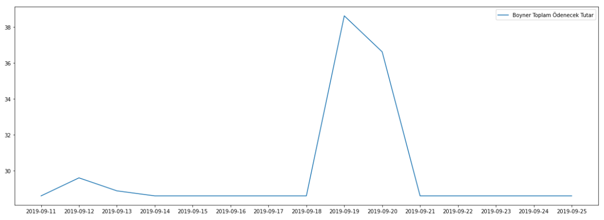

# InvoiceParser
A flexible PDF invoice data parser using pdf conversion, CSS Selectors, OCR, Regex to maintain flexibility while having alternatives to edge conditions

## For OCR install tesseract and poppler
```
sudo apt install tesseract-ocr
sudo apt install libtesseract-dev
sudo apt install poppler-utils
```

## Installing dependencies
```
pip install -r requirements.txt
```

## Plotting the price summary data by time
<p></p>

## Plotting the per product price data by time
<p></p>

## Price summary SQLi DB (summaries)
<p></p>

## Per product price SQLi DB (products)
<p></p>
